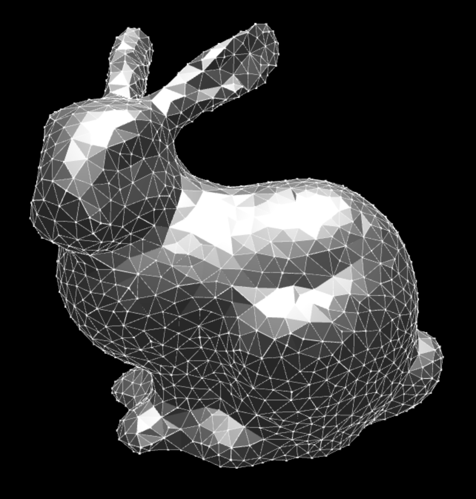
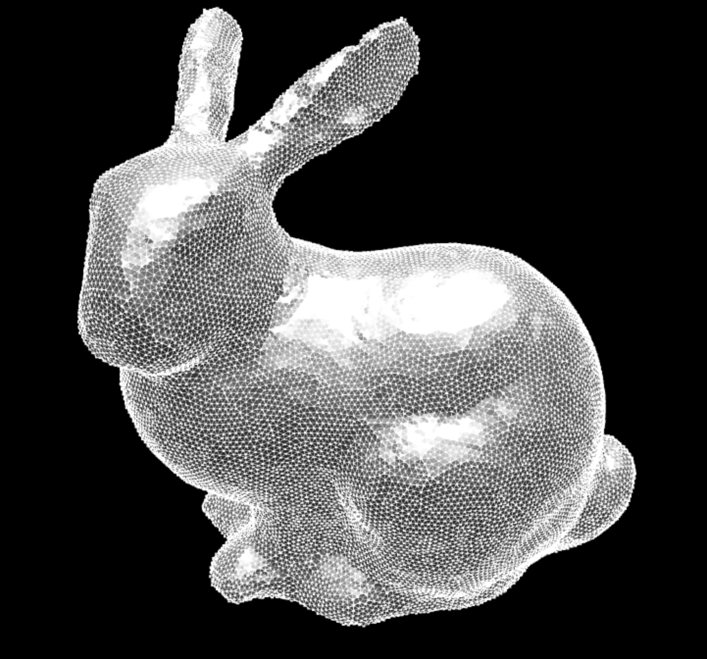

refine-mesh
===========
Iterative mesh refinement based on the technique in

* M. Botsch, L. Kobbelt. 2004 "[A Remeshing Approach to Multiresolution Modeling](http://www.researchgate.net/publication/221316497_A_Remeshing_Approach_to_Multiresolution_Modeling)" EUROGRAPHICS 2004

Give this some garbage mesh as input and it will automagically give you a nice uniformly subdivided mesh.

# Example

```javascript
var refine = require('refine-mesh')
var bunny = require('bunny')

var normals = require('normals').vertexNormals(bunny.cells, bunny.positions)

//Refine the bunny from a base mesh to one with a uniform edge length of 0.1
var refined = refine(
  bunny.cells,
  bunny.positions,
  normals,
  {
    edgeLength: 0.1
  })
```

So, a coarse bunny mesh like this:



Becomes a fine mesh like this:



# Install

```
npm i refine-mesh
```

# API

#### `var mesh = require('refine-mesh')(cells, positions, normals[,options])`
Applies iterative mesh refinement to a cell complex

* `cells` is an array of triples representing the faces of the mesh
* `positions` is an array of `[x,y,z]` triples representing the vertices
* `normals` is an array of `[nx,ny,nz]` triples representing the normals
* `options` is an object with the following properties:
    + `edgeLength` is the desired edge length (default is median edge length)
    + `maxIters` is the maximum number of iterations (default `5`)
    + `splitIters` maximum number of edge split iterations (default `10`)
    + `collapseIters` maximum number of edge collapse iterations (default `10`)
    + `flipIters` maximum number of edge flip iterations (default `10`)
    + `smoothIters` maximum number of smoothing iterations (default `20`)
    + `smoothRate` constant controlling rate of smoothing (default `0.95`)
    + `minSplit` minimum number of splits per iteration (default `0`)
    + `minCollapse` minimum number of collapse operations (default `0`)
    + `minFlip` minimum number of flip operations (default `0`)
    + `minSmooth` minimum smoothing improvement (default `0.01*edgeLength`)

**Returns** An object with the following properties

* `cells` the faces of the resulting mesh
* `positions` vertex positions of result
* `normals` vertex normals of result

# License
(c) 2015 Mikola Lysenko. MIT License
